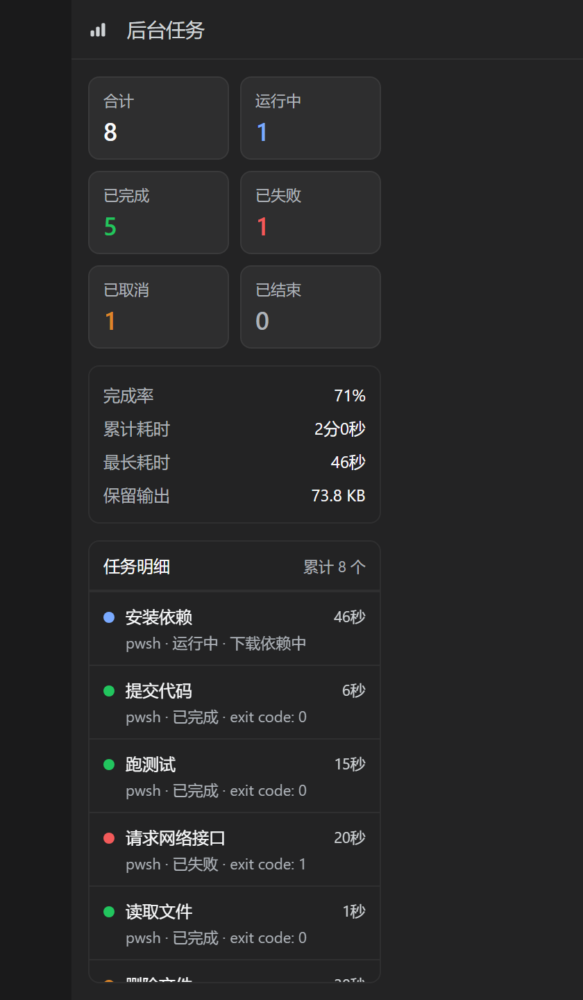
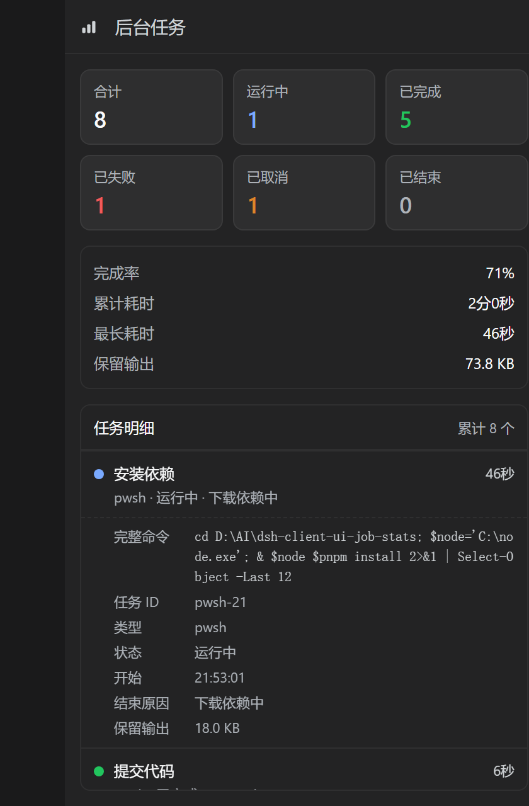

# dsh-client-ui-job-stats

[](https://github.com/kahomesl/dsh-client-ui-job-stats/actions/workflows/ci.yml)
[](LICENSE)


**DeepSeek Harness 的会话后台任务统计：右侧边栏的一个标签页，累计记录本会话跑过的每一个任务。**

**中文** | [English](README.en.md)




这两张图由 `pnpm preview` 用插件**自己的组件**渲染而成 —— 与宿主实际提供的 `client/client.js` 是同一个文件，按渲染器组装的 props 挂载、配色取应用真实深色主题的 token 值，只有任务行是示例数据（真实会话的截图会暴露那个会话跑过什么）。它们声明在 [`screenshots.json`](screenshots.json) 里，插件市场读的就是它。

---

## 它是什么

Harness 自带的会话头部「后台任务」列表是一张**实时名册**：只列会话当前还看得到的任务，而前台命令一旦被调用方取走输出，它的记录就会从名册里消失。所以它适合看"现在在跑什么"，不适合当统计 —— 任务会闪一下就没了。

本插件在右侧边栏里补了一个**统计**席位：

- **在哪** —— 展开右侧边栏（会话头部的「打开侧边栏」按钮 / `Ctrl+Alt+B`），栏内「开始」页会多出第 4 张卡片 **「后台任务统计」**，与随附的「工作区文件 / 新建终端 / 浏览器」并列；点开即在栏内以标签页形式显示面板。
- **显示什么** —— 各状态计数、完成率、累计耗时、最长耗时、保留输出，以及每个任务的明细（状态、类型、耗时、结束原因）；排序为"运行中在前，已结束按结束时间倒序"。
- **范围** —— 一个会话一个标签页：面板只统计它是从哪个会话打开的。
- **语言** —— 简体中文与英文，跟随宿主语言。
- **累计** —— 面板记住它见过的每个任务，因此任务结束后仍留在统计里，而不是随名册消失。

## 功能

| | |
|---|---|
| 计数 | 合计 / 运行中 / 已完成 / 已失败 / 已取消 / 已结束 |
| 指标 | 完成率（只统计**已上报结果**的任务）、累计耗时、最长耗时、保留输出字节数 |
| 明细 | 每任务一行：状态点、概述、类型 · 状态 · 原因、耗时；列表自身可滚动（表头固定） |
| 说人话 | 能识别的命令显示"在干什么"—— 等待 75 秒 / 提交代码 / 跑测试 / 安装依赖 —— 而不是把代码原样贴出来 |
| 点击展开 | 点一下任务行展开：完整命令、任务 ID、类型、状态、开始/结束时刻、结束原因、保留输出 |
| 实时 | 有任务在跑时，耗时每秒刷新 |
| 台账 | 按会话分开、按 job id 合并、写入浏览器存储（上限 300 条，超出先淘汰最早已结束的） |
| 健壮 | 未知状态、缺 id、字段异常、台账损坏都不会抛错，也不会让面板变空 |

## 安装

插件就是一个普通的 Harness 组合包（bundle），从源码目录以 link 方式装进某个 profile：

```bash
git clone https://github.com/kahomesl/dsh-client-ui-job-stats.git
```

1. 在该 profile 目录（`package.json` 里列着 `dsh.profile.bundles` 的那个，例如 `~/.dsh/profiles/desktop`）中，把它加为本地依赖并选为组合包：

   ```jsonc
   {
     "dependencies": {
       "dsh-client-ui-job-stats": "link:/本机绝对路径/dsh-client-ui-job-stats"
     },
     "dsh": {
       "profile": {
         "bundles": [
           // …原有的组合包…
           "dsh-client-ui-job-stats"
         ]
       }
     }
   }
   ```

2. 安装：

   ```bash
   pnpm install
   ```

3. 展开右侧边栏，「开始」页上就有 **「后台任务统计」** 卡片。宿主会自行重新读取变更过的客户端 bundle，面板本身不需要重启。
4. **重启一次 DSH。** 宿主侧半成品（终态记录器）是一条 Loader 行，而 bundle patch 里的行是在**启动时**组合的；重启之前面板照常工作，但只能讲名册自己知道的故事（见"已知限制"）。每次安装需要重启一次，之后的更新不需要。

包内的 `cordis.patch.yml` 只做两件事：向组合插入两条 Loader 行 —— `job-stats` → 本包（由它发布浏览器半侧）与 `job-stats-recorder` → 本包的 `./recorder` 子路径（宿主半侧）；不改动 profile 里的其它任何东西。

**停用 / 卸载** —— 从 `dsh.profile.bundles` 里删掉包名即可停用（保留依赖随时可再打开）；两处都删掉再 `pnpm install` 即卸载。

**依赖** 组合里需要有 `@deepseek-ai/dsh-client-ui-sidebar-right` 与 `@deepseek-ai/dsh-api-job-controller`。没有它们时插件保持"未激活"，不会激活失败。

## 数字是怎么来的

面板读 `ctx.jobs`（`@deepseek-ai/dsh-api-job-controller` 暴露给浏览器的任务名册镜像），并在其之上加了一层台账：

1. 标签页挂载期间保持该会话的名册流打开（`ctx.jobs.watchRows(sessionId)`）；流的首帧就是完整事实。
2. 每一帧按 job id 合并进该会话的台账 —— 状态、耗时、结束原因、保留字节数原地更新，同一个任务不会出现两次。
3. 统计与明细都从台账算出，所以任务被宿主移除后仍留在面板里。台账持久化在浏览器存储的 `dsh-job-stats/v2/<sessionId>` 下（写入有节流；存储写满或损坏时自动退回"仅内存"）。只有终态记录会被读回，刷新页面不会复活一条假的"运行中"。
4. **终态来自宿主并落盘**：记录器行订阅注册表的 `settled` 事件（前台命令终态的唯一见证者），把它们**持久化**在 profile 内的 `.job-stats/ledger.json`。面板每 2 秒轮询该路由（按 `document.baseURI` 相对解析）并合并：名册抛弃的行会变成真实的 已完成/已失败/已取消（带结束原因），标签页没见过运行过程的任务也会带着结局补进来。因为台账在宿主侧，**重启后再打开面板仍能看到上一次运行结算的任务** —— 这条链路不依赖浏览器存储。

### 台账文件

| | |
|---|---|
| 路径 | 按宿主真正拥有的事实逐级判定：`DSH_PROFILE_DIR` → `DSH_HOME`/`DSH_PROFILE` → **启动器在命令行里传的 profile 目录**（`dsh-desktop-host` 一定会传，形如 `C:\Users\你\.dsh\profiles\desktop`）→ 最后退回 harness home（`$DSH_HOME`，没有则 `~/.dsh`，即框架自己的默认值）。桌面版宿主**不导出** `DSH_HOME`/`DSH_PROFILE`，所以这一条 argv 规则就是它在用的那条；用的是哪条规则会在路由的 `recorder.pathSource` 里说明 |
| 条数 | **每会话最多 200 条**，超出先淘汰最早的结算；最多 32 个会话，超出先淘汰最久没结算的 |
| 体积 | 200 条真实命令 ≈ **53 KB**；最坏情况（每条命令都到 2000 字符上限）≈ 420 KB |
| 写入 | 窗口（1 秒）外立即写；窗口内的多次结算合并成**一次尾部写**，窗口结束时一定落盘 —— 因此"最后一批"不会因为崩溃/强杀而留在内存里。写的是**当下的完整台账**（迟到的定时器不会写出旧数据），只有写入成功才清 dirty，写失败按有上限的退避重试。行卸载时立即 flush 并取消定时器；先写临时文件再改名，崩溃不会留下半个文件 |
| 读回 | 只认自己的 `schema` 标记，别的文件一概不读；若上次是在"写临时文件"和"改名"之间被杀，会把这个临时文件提升为正式台账 |
| 删除 | 任何时候都可以删：它只是已结算任务的记录，后续结算会重新建立 |

### 出问题时怎么定位

宿主路由的响应里除了 `outcomes` 还有一个 `recorder` 块：台账路径与判定来源、装载结果（正常/忽略别的 schema/从临时文件恢复）、持久化状态（`dirty`、`pending`、`writes`、`failures`、`lastError`）与订阅健康（`state`、`attempts`、`lastError`）。面板侧同理：outcomes 轮询会记录 `lastOkAt`/`lastErrorAt`/`consecutiveFailures`/`lastStatusCode`/`lastError`，**第一次失败 warn，之后只在次数翻倍时再报**，恢复时打一条 info 说明失败了几次；名册流打不开会按有上限的退避重试（卸载即停），浏览器台账在窗口结束时补写、页面 `pagehide` 或插件卸载时立即落盘。这样"中间少了一段"能直接看出是哪条链断的，而不是又一次静默失败。

### 任务概述从哪来

任务行的第一行是"这个任务在干什么"，由面板**本地**从 label（shell 任务的 label 就是命令本身）归纳：先把命令拆成语句、跳过准备动作（`cd …`、变量赋值、重定向），再识别真正的动作 —— `git commit` → 提交代码、`pnpm install` → 安装依赖、`Start-Sleep -Seconds 75` → 等待 75 秒、`Get-Content` → 读取文件、vitest → 跑测试；git、包管理器、解释器、PowerShell cmdlet、容器与构建工具都有覆盖。

识别在两个方向上都刻意保守：**认不出来的命令原样显示**；label 本身就是描述的任务（有些 producer 会这么写）不会被改写 —— 归纳错了比显示原文更糟。完整命令永远只差一次点击，也保留在行的悬浮提示里。

### 已知限制

- 台账记录**标签页开着**时看到过的任务，外加宿主记录器上报的终态。若某任务在标签页关闭期间开始并结束、且已经从记录器环形缓冲里被淘汰，则无法统计。
- **宿主半侧尚未组合时**（还没重启，或组合里没有 web server），前台命令的结局不可观测：工具在调用方取走输出时就把记录从名册删掉了，而名册流是合并后再读列表的，所以"已结算"这一帧读不到 —— 面板只看到它"运行中"，随后就不见了。这类记录只显示为**已结束** —— 不算运行中，也不硬猜成已完成或已失败；此时「完成率」只覆盖已上报结果的结算任务。
- 还在等待结局的「已结束」记录，耗时 = 从开始到最后一次被看到（宿主把它撤下名册的时刻，误差约一秒内）。
- 宿主台账记录的是它亲眼看过的结算；在记录器行加载之前就已结束的任务无法补回（它们的终态只存在于那个已经消失的进程里）。两本台账并存：宿主那本持久（每会话 200 条、跨重启），标签页自己那本在浏览器存储里（每会话 300 条，路由不可达时也保住你看到过的行）。
- 面板是只读统计；停止任务仍由会话头部的任务列表负责。

## 实现方式

两侧、零构建：

| 文件 | 作用 |
|---|---|
| `package.json` | 清单：`dsh.bundle.patch`（组合补丁）+ `dsh.client`（浏览器半侧，platform `web`） |
| `cordis.patch.yml` | 插入两条 Loader 行：`job-stats` → 本包（发布浏览器半侧）、`job-stats-recorder` → `./recorder` 子路径（宿主半侧） |
| `lib/index.js` | 宿主半侧：Loaders 可见的空实现；界面在浏览器侧 |
| `lib/recorder.js` | 宿主半侧：从注册表事件流记录任务终态，并在 `/dsh-job-stats/outcomes` 上提供 |
| `client/client.js` | 浏览器半侧：标签类型、开始页卡片、统计面板 |

三处注册，全部走公开契约：

| 注册 | 席位 | 效果 |
|---|---|---|
| `ctx.sidebarRightTabs.register({ id, kind: 'job-stats', title, guide })` | 右侧边栏标签注册表 | 标签类型、标签条标题、开始页卡片 |
| `sidebar.right.pane.tab`（以类型 id 为键） | 栏内面板（session 作用域） | 面板正文；`sessionId` 由宿主从标签页传入 |
| `sidebar.right.pane.tab.title`（以类型 id 为键） | 标签条 | 类型标签前的自定义图标 |

实现遵守的几条规则：

- **不导入任何 Harness 客户端包**：React 来自浏览器模块表（`require('react')`），面板自绘控件，宿主升级不会让入口变空。
- **只用主题 token**（`--dsw-*`，附字面量兜底），亮/暗色自动适配。
- **可选服务作用域**：整个贡献放在 `ctx.inject(['sidebarRightTabs'], …)` 内，没有右侧边栏的组合只是不激活，而不是抛错。
- **模块工厂无副作用**：注册与拆卸都由 `ctx.effect` 持有，卸载后注册表干净。

## 开发与测试

```bash
pnpm install
pnpm test        # 34 个用例：包清单、标签类型与席位注册、面板行为、台账
```

规格刻意用真实实现而不是桩：浏览器半侧按页面加载它的方式载入（一段经典脚本向 `window.__ModuleLoader__` 注册一个惰性 factory），slot 注册表是 `@deepseek-ai/dsh-client-ui-slots` 里生产的 `SlotCore`，面板由真实 React 以渲染器组装的 props 渲染。于是"清单写错""注册了外壳寻址不到的席位"这类问题会在 CI 里失败，而不是在运行中的页面里翻车。

改动前的验证清单见 [CONTRIBUTING.md](CONTRIBUTING.md)。

## 兼容性

已在 DeepSeek Harness **0.1.7-rc.2**（DSH Desktop，Windows 11，125% 显示缩放）验证：Loader 行能组合、宿主按匹配的 revision 提供浏览器半侧、开始页卡片与栏内面板均正常渲染。

## 许可

[MIT](LICENSE)
