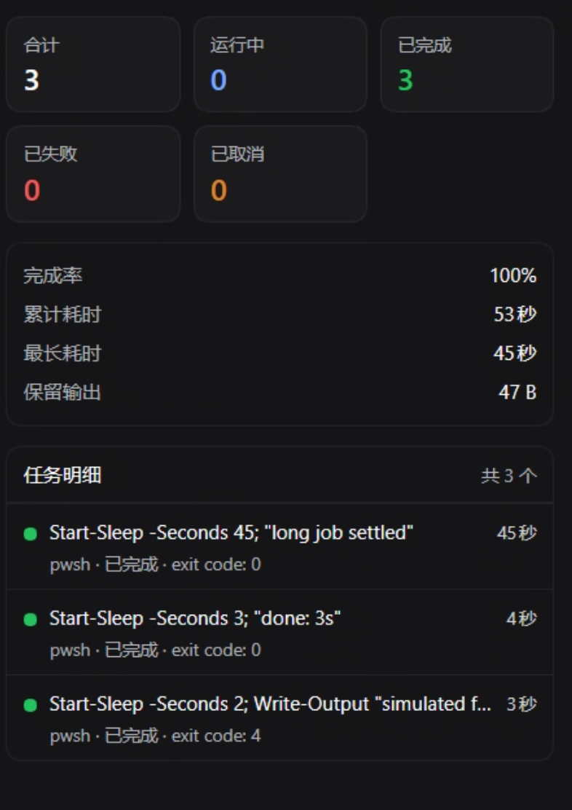

# dsh-client-ui-job-stats

[](https://github.com/kahomesl/dsh-client-ui-job-stats/actions/workflows/ci.yml)
[](LICENSE)


**Session background-job statistics for DeepSeek Harness: a right Sidebar tab that keeps a running ledger of every job the session ran.**

中文说明见 [README.zh.md](README.zh.md).



---

## What it is

DeepSeek Harness ships a *live* job roster in the session header: it lists what the session can currently see, and a foreground command's record leaves that roster the moment the call that started it collects the output. That makes it a good progress indicator and a poor statistics view — a task flashes and disappears.

This plugin adds a **statistics** seat next to it, inside the right Sidebar:

- **Where** — expand the right Sidebar (the session header's 「打开侧边栏」 button / `Ctrl+Alt+B`). The column's start page gains a fourth card, **Background job stats**, next to the shipped 工作区文件 / 新建终端 / 浏览器 types. Picking it opens the panel as a dock tab.
- **What** — totals per status, success rate, accumulated and longest duration, retained output, and a per-task list (status, kind, duration, terminal reason), ordered live-first then newest-settled-first.
- **Scope** — one tab per session: the panel shows the session it was opened in, and nothing else.
- **Language** — Simplified Chinese and English, following the host language.
- **Accumulation** — the panel remembers every job it has seen, so finished tasks stay in the statistics instead of vanishing from the live roster.

## Features

| | |
|---|---|
| Counts | 合计 / 运行中 / 已完成 / 已失败 / 已取消 / 已结束 (total / running / completed / failed / cancelled / ended) |
| Figures | success rate over reported outcomes (completed ÷ settled), accumulated duration, longest single job, retained output bytes |
| Detail list | one row per task: status dot, summary line, kind · status · reason, elapsed time; the list scrolls on its own, with a pinned head |
| Plain-language summaries | a recognised command reads as what it does — 等待 75 秒 / 提交代码 / 跑测试 / 安装依赖 — in the host language, instead of quoting the code |
| Detail on demand | click a row to expand it: the full command, job id, kind, status, start and finish clock, terminal reason and retained output |
| Live clock | running jobs tick once a second while the tab is open |
| Ledger | per-session, merged by job id, persisted in browser storage (300 records, oldest settled evicted first) |
| Defensive | unknown statuses, missing ids, forged fields and an unreadable ledger never throw and never blank the tab |

## Install

The plugin is a normal Harness bundle. Install it into a profile from a checkout (this is how it is used on the development machine):

```bash
git clone https://github.com/kahomesl/dsh-client-ui-job-stats.git
```

1. In your profile directory (the one whose `package.json` lists `dsh.profile.bundles`, e.g. `~/.dsh/profiles/desktop`), add the package as a local link and select it as a bundle:

   ```jsonc
   {
     "dependencies": {
       "dsh-client-ui-job-stats": "link:/absolute/path/to/dsh-client-ui-job-stats"
     },
     "dsh": {
       "profile": {
         "bundles": [
           // …your existing bundles…
           "dsh-client-ui-job-stats"
         ]
       }
     }
   }
   ```

2. Install it:

   ```bash
   pnpm install
   ```

3. Expand the right Sidebar — the **Background job stats** card is on its start page. The host re-reads a changed client bundle on its own, so the panel needs no restart.
4. **Restart DSH once.** The Host half (the outcome recorder) is a Loader row, and rows from a bundle patch are composed at boot; until that restart the panel works but can only report the roster's own story (see *Known limits*). A restart is needed once per install, not per update.

`cordis.patch.yml` in this package inserts both of its Loader rows; nothing else in the profile is touched.

**Disable / uninstall** — remove the name from `dsh.profile.bundles` to switch it off (keep the dependency to switch it back on), or remove both entries and run `pnpm install` again to uninstall.

**Requires** `@deepseek-ai/dsh-client-ui-sidebar-right` and `@deepseek-ai/dsh-api-job-controller` in the composition. Without them the plugin simply stays inactive — it never fails activation.

## How the numbers are computed

The panel reads `ctx.jobs`, the client mirror of the job roster (`@deepseek-ai/dsh-api-job-controller`), and adds a ledger on top:

1. While the tab is mounted it holds the session's roster stream open (`ctx.jobs.watchRows(sessionId)`); the stream's first frame is already the whole truth.
2. Every frame is merged into a per-session ledger keyed by job id — status, duration, terminal reason and retained bytes are updated in place, so a job never appears twice.
3. Statistics and the list are computed from the ledger, which is why a finished task stays after the host removes its record. The ledger is persisted under `dsh-job-stats/v2/<sessionId>` in browser storage (throttled writes; a full or unreadable store degrades to memory only). Only terminal records are hydrated, so a reloaded page cannot resurrect a stale "running" row.
4. **Outcomes come from the Host.** While the panel is open it polls the recorder row's route (`dsh-job-stats/outcomes`, resolved document-relatively against `document.baseURI`) every two seconds and merges what it reports: a row the roster abandoned becomes a real 已完成 / 已失败 / 已取消 with the terminal reason, and a job this tab never saw while it ran is added with its outcome. The recorder keeps the last 2000 settlements in the process, keyed by session, and a 405/404/unreachable route simply leaves the panel on its own ledger.

### Task summaries

The row's first line is a summary of what the task is doing, derived locally from its label (which for a shell job is the command itself): the panel splits the command into statements, skips setup (`cd …`, assignments, redirections) and recognisers the action — `git commit` → 提交代码, `pnpm install` → 安装依赖, `Start-Sleep -Seconds 75` → 等待 75 秒, `Get-Content` → 读取文件, a vitest run → 跑测试, and so on for git, package managers, interpreters, PowerShell cmdlets, containers and build tools.

Recognition is deliberately conservative in both directions: a command it does not understand is shown **as it is**, and a label that is already a description (some producers write one) is left alone — a wrong summary would be worse than the raw text. The exact command is always one click away, and it stays in the row's tooltip.

### Known limits

- The ledger records what the tab saw **while it was open**, plus what the Host recorder reports. A job that starts and ends entirely while the tab is closed *and* has already fallen out of the recorder's ring cannot be counted.
- **Before the Host half is composed** (no restart yet, or a composition without a web server), a collected command's outcome is not observable: its record is removed as soon as the call collected the output, often inside the coalescing window that would have reported the settlement. Those rows are shown as **已结束 / ended** — no success, no failure, no running — and the success-rate figure then covers reported outcomes only.
- An ended record still waiting for its outcome has its duration measured from its start to its last sighting (when the Host retired it, within a second or so).
- The ledger is capped at 300 records per session; the oldest settled records are evicted first. The recorder's ring is capped at 2000 settlements per process.
- The panel is read-only: stopping a job stays in the session header's job list.

## How it works

Two halves, no build step:

| File | Role |
|---|---|
| `package.json` | Manifest: `dsh.bundle.patch` (the composition patch) and `dsh.client` (the browser half, platform `web`) |
| `cordis.patch.yml` | Inserts two Loader rows: `job-stats` → the package (it publishes the browser half) and `job-stats-recorder` → its `./recorder` subpath (the Host half) |
| `lib/index.js` | Node half: a Loader-visible no-op; the browser half carries the UI |
| `lib/recorder.js` | Host half: records job outcomes off the registry's event stream and serves them on `/dsh-job-stats/outcomes` |
| `client/client.js` | Browser half: the tab type, its start-page card, and the panel |

Registrations, all through public contracts:

| Registration | Seat | Effect |
|---|---|---|
| `ctx.sidebarRightTabs.register({ id, kind: 'job-stats', title, guide })` | right Sidebar tab registry | the type, its tab-strip label, and the start-page card |
| `sidebar.right.pane.tab` (keyed by the type id) | dock pane (session scope) | the panel body; the session id arrives in its props |
| `sidebar.right.pane.tab.title` (keyed by the type id) | dock tab strip | the plugin's glyph before the type label |
| `ctx.jobs.events.subscribe({ owners: 'all' }, …)` (Host) | job registry event stream | terminal projections, including the settlements the roster never delivers to the browser |
| `ctx.webServer.register({ kind: 'exact', path: '/dsh-job-stats/outcomes' })` (Host) | Host routes | the JSON the panel reads its outcomes from |

Design rules the implementation follows:

- **No Harness Client package is imported.** React comes from the browser module table (`require('react')`) and the panel draws its own markup, so a rebuilt Host cannot blank the entry.
- **Theme tokens only** (`--dsw-*`, with literal fallbacks): light and dark themes come for free.
- **Optional-service scoping** — the whole contribution sits inside `ctx.inject(['sidebarRightTabs'], …)`, so a composition without the right Sidebar keeps the plugin inactive instead of throwing.
- **No side effects in the module factory**; registration and teardown are owned by `ctx.effect`, and disposal leaves the registry clean.

## Development

```bash
pnpm install
pnpm test        # 34 specs: manifest, tab-type + seat registration, panel behaviour, ledger
```

The specs are deliberately real rather than mocked: the browser half is loaded the way a page loads it (a classic script registering one lazy factory into `window.__ModuleLoader__`), the slot registry is the production `SlotCore` from `@deepseek-ai/dsh-client-ui-slots`, and the panel is rendered by real React with the props the renderer composes. A malformed manifest or a registration the shell cannot address therefore fails in CI, not in the running page.

See [CONTRIBUTING.md](CONTRIBUTING.md) for the verification checklist used before a change ships.

## Compatibility

Verified on DeepSeek Harness **0.1.7-rc.2** (DSH Desktop, Windows 11, 125 % display scaling): the Loader row composes, the host serves the browser half with a matching revision, and the card and panel render in the right Sidebar.

## License

[MIT](LICENSE)
